# 📚 Personal Design Patterns Knowledge Base

> *My reference guide for design patterns implementations in JavaScript*

## 🎯 Purpose

This repository serves as my personal knowledge base for understanding and implementing design patterns in JavaScript. It uses a simple todo application as the foundation to demonstrate various architectural patterns in real, working code.

---

## 📊 Architecture Diagrams

### **Class Diagram - Current Implementation**

```mermaid
classDiagram
    class TodoList {
        -Set~TodoItem~ #data
        -static TodoList instance
        +static getInstance() TodoList
        +add(item) void
        +delete(item) void
        +find(item) TodoItem
        +replaceList(newList) void
        +get items() Set~TodoItem~
        +addObserver(observer) void
        +removeObserver(observer) void
        +notify() void
    }
    class TodoItem {
        +string text
        +equals(other) boolean
    }
    class observerMixin {
        <<mixin>>
        +Set~Function~ observers
        +addObserver(observer) void
        +removeObserver(observer) void
        +notify() void
    }
    class Command {
        +name
        +args
        +execute() void
    }
    class commandExcecutor {
        +execute(command) void
    }
    TodoList --> TodoItem : contains
    TodoList ..|> observerMixin : implements via mixin
    commandExcecutor ..> Command : executes
    Command ..> TodoList : operates on
    note for TodoList "🔹 Singleton Pattern\n🔹 Observer Pattern"
    note for observerMixin "🔹 Observer Pattern\nReusable via mixin"
    note for Command "🔹 Command Pattern"
    note for commandExcecutor "🔹 Command Pattern\nCentralized execution"
    classDef singleton fill:#e3f2fd,stroke:#1976d2,stroke-width:3px
    classDef observer fill:#f3e5f5,stroke:#7b1fa2,stroke-width:2px
    classDef mixin fill:#fff3e0,stroke:#f57c00,stroke-width:2px
    classDef entity fill:#e8f5e8,stroke:#388e3c,stroke-width:2px
    classDef command fill:#ffe0e0,stroke:#d32f2f,stroke-width:2px
    class TodoList singleton
    class observerMixin mixin
    class TodoItem entity
    class Command command
    class commandExcecutor command
```


### **Pattern Interaction Flow**

```mermaid
sequenceDiagram
    participant C as Client
    participant CE as commandExcecutor
    participant CMD as Command
    participant TL as TodoList
    participant O1 as Observer1
    participant O2 as Observer2

    Note over TL: 🔹 Singleton Pattern
    C->>TL: getInstance()
    TL-->>C: same instance always

    Note over CE,CMD: 🔹 Command Pattern
    C->>CMD: new Command(ADD, ...)
    C->>CE: execute(CMD)
    CE->>CMD: execute()
    CMD->>TL: add/delete/find

    Note over TL,O2: 🔹 Observer Pattern Setup
    C->>TL: addObserver(Observer1)
    C->>TL: addObserver(Observer2)

    Note over TL,O2: State Change & Notification
    CMD->>TL: add({text: "New Todo"})
    activate TL
    TL->>TL: notify()
    TL->>O1: execute()
    TL->>O2: execute()
    deactivate TL

    Note over C,O2: All observers updated automatically
```


### **Pattern Application Map**

```mermaid
flowchart TD
    A[🎯 TodoMasters App] --> B[🔹 Singleton Pattern]
    A --> C[🔹 Observer Pattern]
    A --> D[🕹️ Command Pattern]

    B --> E[📍 TodoList.getInstance]
    B --> F[🗂️ Global State Management]
    B --> G[📋 Single Source of Truth]

    C --> H[📄 observerMixin.js]
    C --> I[🔄 Automatic UI Updates]
    C --> J[🔗 Loose Coupling]

    D --> K[📄 Command.js]
    D --> L[🧩 commandExcecutor]
    D --> M[🗂️ Centralized Action Handling]

    E --> N[📁 src/TodoList.js]
    H --> N
    K --> N

    classDef singleton fill:#e3f2fd,stroke:#1976d2,stroke-width:3px
    classDef observer fill:#f3e5f5,stroke:#7b1fa2,stroke-width:3px
    classDef command fill:#ffe0e0,stroke:#d32f2f,stroke-width:2px
    classDef file fill:#e8f5e8,stroke:#388e3c,stroke-width:2px
    classDef feature fill:#fff3e0,stroke:#f57c00,stroke-width:2px

    class B singleton
    class C observer
    class D command
    class N file
    class E,F,G,H,I,J,K,L,M feature
```


---

src/
├── TodoList.js        # 👤 Singleton + 👀 Observer (via mixin)
├── TodoItem.js        # Simple value object/data structure
mixings/
├── observerMixin.js   # 👀 Observer pattern implementation
## 🏗️ Currently Implemented Patterns

### 1. **Singleton Pattern** 👤
**Purpose:** Ensures only one instance of a class exists throughout the application

**Location:** `src/TodoList.js`

**Implementation Details:**
- Uses static initialization block to create the single instance
- Private constructor throws error to prevent direct instantiation
- `getInstance()` method provides controlled access to the instance
- Manages global todo state across the application

**Key Benefits:**
- Global state management
- Memory efficiency
- Controlled access to shared resources

---

### 2. **Observer Pattern** 👀
**Purpose:** Allows objects to notify multiple observers about state changes

**Location:** `mixings/observerMixin.js` (applied to `TodoList`)

**Implementation Details:**
- Mixin-based implementation for reusability
- Uses Set to store observer functions
- `addObserver()`, `removeObserver()`, and `notify()` methods
- Automatically notifies observers when todo list changes

**Key Benefits:**
- Loose coupling between components
- Automatic UI updates when data changes
- Extensible notification system

---

### 3. **Command Pattern** �️
**Purpose:** Encapsulates requests as objects, allowing parameterization, queuing, and undo/redo operations.

**Location:** `src/Command.js`, `src/utils/commands.js`, usage in `app.js`

**Implementation Details:**
- `Command` class represents an action (add, delete, etc.) with its arguments.
- `commandExcecutor` handles execution logic for each command type.
- All UI actions (add/delete) are dispatched as commands, decoupling UI from business logic.
- Command types are defined in `src/utils/commands.js`.

**Key Benefits:**
- Decouples UI events from logic
- Centralizes action handling
- Prepares the codebase for undo/redo and more complex command flows

---

## �📁 File Structure & Pattern Mapping

```
app.js                  # Main entry, UI logic, command dispatch
index.html              # HTML UI
styles.css              # Styles
src/
├── Command.js          # 🕹️ Command pattern implementation
├── TodoList.js         # 👤 Singleton + 👀 Observer (via mixin)
├── TodoItem.js         # Simple value object/data structure
├── utils/
│   └── commands.js     # 🕹️ Command type definitions
├── mixings/
│   └── observerMixin.js# 👀 Observer pattern implementation
```

## 🔍 Pattern Analysis

### **Design Decisions Made:**

1. **Singleton for TodoList**: Chosen because we need a single source of truth for todo data across the application
2. **Observer via Mixin**: Allows reusability of observer functionality across different classes
3. **Simple TodoItem**: Basic data structure with equality comparison for Set operations

### **Why These Patterns Work Together:**
- Singleton ensures consistent data access
- Observer enables reactive updates to UI components
- Mixin approach keeps patterns modular and reusable

## 🧠 Learning Notes

### **Singleton Pattern Insights:**
- Modern JavaScript approach using static initialization blocks
- Error-throwing constructor prevents accidental instantiation
- Better than traditional lazy initialization for this use case

### **Observer Pattern Insights:**
- Mixin implementation is more flexible than inheritance
- Using Set for observers prevents duplicate registrations
- Function-based observers keep implementation simple

### **JavaScript-Specific Considerations:**
- Private fields (`#data`) provide true encapsulation
- Static blocks are modern ES2022 feature
- Object.assign() for mixin application is clean and readable

## 🚀 Quick Reference

### **To Add New Observer:**
```javascript
const todoList = TodoList.getInstance()
todoList.addObserver(() => {
    // React to todo list changes
})
```

### **To Access Todo Data:**
```javascript
const todoList = TodoList.getInstance()
const items = todoList.items // Returns Set of TodoItem instances
```

### **To Dispatch a Command (Add/Delete):**
```javascript
import Command, { commandExcecutor } from './src/Command.js'
import { Commands } from './src/utils/commands.js'

// Add a todo
const addCommand = new Command(Commands.ADD)
commandExcecutor.execute(addCommand)

// Delete a todo
const deleteCommand = new Command(Commands.DELETE, ['Some todo text'])
commandExcecutor.execute(deleteCommand)
```

## 🔮 Future Pattern Implementations

### **Planned Additions:**
- **Undo/Redo for Command Pattern**: Enable undo/redo for user actions
- **Strategy Pattern**: For different sorting/filtering algorithms
- **Factory Pattern**: For creating different types of todo items
- **Memento Pattern**: For state history management

### **Implementation Priority:**
1. Undo/Redo for Command Pattern (high impact for user experience)
2. Strategy Pattern (good for demonstrating algorithm flexibility)
3. Factory Pattern (useful as complexity grows)
4. Memento Pattern (advanced state management)

## 💡 Personal Reminders

### **When to Use Singleton:**
- Global state management
- Resource-heavy objects that should be shared
- Configuration objects
- **Caution**: Can make testing difficult, use sparingly

### **When to Use Observer:**
- UI updates based on data changes
- Event-driven architectures
- Loose coupling between components
- **Tip**: Consider using native DOM events for UI-related observations

### **Code Quality Notes:**
- Always document pattern usage with comments
- Keep patterns simple and focused
- Prefer composition over inheritance when possible
- Test patterns in isolation when feasible

---

*Last updated: Personal learning project - Design patterns in practice* 📝
