# 📚 Personal Design Patterns Knowledge Base

> *My reference guide for design patterns implementations in JavaS---

## �️ Currently Implemented Pa### 2. **Observe---

## 📁 File Structure & Pattern Mapping

```
src/
├── TodoList.js        # 👤 Singleton + 👀 Observer (via mixin)
├── TodoItem.js        # Simple value object/data structure
mixings/
├── observerMixin.js   # 👀 Observer pattern implementation
``` 👀ternsrpose

This repository serves as my personal knowledge base for understanding and implementing design patterns in JavaScript. It uses a simple todo application as the foundation to demonstrate various architectural patterns in real, working code.

---

## 📊 Architecture Diagrams

### **Class Diagram - Current Implementation**

```mermaid
classDiagram
    class TodoList {
        -Set~TodoItem~ #data
        -static TodoList instance
        +static getInstance() TodoList
        +add(item) void
        +delete(item) void
        +find(item) TodoItem
        +replaceList(newList) void
        +get items() Set~TodoItem~
        +addObserver(observer) void
        +removeObserver(observer) void
        +notify() void
    }
    
    class TodoItem {
        +string text
        +equals(other) boolean
    }
    
    class observerMixin {
        <<mixin>>
        +Set~Function~ observers
        +addObserver(observer) void
        +removeObserver(observer) void
        +notify() void
    }
    
    TodoList --> TodoItem : contains
    TodoList ..|> observerMixin : implements via mixin
    
    note for TodoList "� Singleton Pattern\n� Observer Pattern"
    note for observerMixin "� Observer Pattern\nReusable via mixin"
    
    classDef singleton fill:#e3f2fd,stroke:#1976d2,stroke-width:3px
    classDef observer fill:#f3e5f5,stroke:#7b1fa2,stroke-width:2px
    classDef mixin fill:#fff3e0,stroke:#f57c00,stroke-width:2px
    classDef entity fill:#e8f5e8,stroke:#388e3c,stroke-width:2px
    
    class TodoList singleton
    class observerMixin mixin
    class TodoItem entity
```


### **Pattern Interaction Flow**

```mermaid
sequenceDiagram
    participant C as Client
    participant TL as TodoList
    participant O1 as Observer1
    participant O2 as Observer2
    
    Note over TL: � Singleton Pattern
    C->>TL: getInstance()
    TL-->>C: same instance always
    
    Note over TL,O2: � Observer Pattern Setup
    C->>TL: addObserver(Observer1)
    C->>TL: addObserver(Observer2)
    
    Note over TL,O2: State Change & Notification
    C->>TL: add({text: "New Todo"})
    activate TL
    TL->>TL: notify()
    TL->>O1: execute()
    TL->>O2: execute()
    deactivate TL
    
    Note over C,O2: All observers updated automatically
```


### **Pattern Application Map**

```mermaid
flowchart TD
    A[🎯 TodoMasters App] --> B[� Singleton Pattern]
    A --> C[� Observer Pattern]
    
    B --> D[📍 TodoList.getInstance]
    B --> E[🗂️ Global State Management]
    B --> F[📋 Single Source of Truth]
    
    C --> G[📄 observerMixin.js]
    C --> H[🔄 Automatic UI Updates]
    C --> I[🔗 Loose Coupling]
    
    D --> J[📁 src/TodoList.js]
    G --> J
    
    classDef singleton fill:#e3f2fd,stroke:#1976d2,stroke-width:3px
    classDef observer fill:#f3e5f5,stroke:#7b1fa2,stroke-width:3px
    classDef file fill:#e8f5e8,stroke:#388e3c,stroke-width:2px
    classDef feature fill:#fff3e0,stroke:#f57c00,stroke-width:2px
    
    class B singleton
    class C observer
    class J file
    class D,E,F,G,H,I feature
```


## 📁 File Structure & Pattern Mapping

```
src/
├── TodoList.js        # 👤 Singleton + 👀 Observer (via mixin)
├── TodoItem.js        # Simple value object/data structure
mixings/
├── observerMixin.js   # 👀 Observer pattern implementation
```erence guide for design patterns implementations in JavaScript*

## � Purpose

This repository serves as my personal knowledge base for understanding and implementing design patterns in JavaScript. It uses a simple todo application as the foundation to demonstrate various architectural patterns in real, working code.

## 🏗️ Currently Implemented Patterns

### 1. **Singleton Pattern** 👤
**Purpose:** Ensures only one instance of a class exists throughout the application

**Location:** `src/TodoList.js`

**Implementation Details:**
- Uses static initialization block to create the single instance
- Private constructor throws error to prevent direct instantiation
- `getInstance()` method provides controlled access to the instance
- Manages global todo state across the application

**Key Benefits:**
- Global state management
- Memory efficiency
- Controlled access to shared resources

---

### 2. **Observer Pattern** �
**Purpose:** Allows objects to notify multiple observers about state changes

**Location:** `mixings/observerMixin.js` (applied to `TodoList`)

**Implementation Details:**
- Mixin-based implementation for reusability
- Uses Set to store observer functions
- `addObserver()`, `removeObserver()`, and `notify()` methods
- Automatically notifies observers when todo list changes

**Key Benefits:**
- Loose coupling between components
- Automatic UI updates when data changes
- Extensible notification system

---

## 📁 File Structure & Pattern Mapping

```
src/
├── TodoList.js        # 👤 Singleton + � Observer (via mixin)
├── TodoItem.js        # Simple value object/data structure
mixings/
├── observerMixin.js   # 👀 Observer pattern implementation
```

## 🔍 Pattern Analysis

### **Design Decisions Made:**

1. **Singleton for TodoList**: Chosen because we need a single source of truth for todo data across the application
2. **Observer via Mixin**: Allows reusability of observer functionality across different classes
3. **Simple TodoItem**: Basic data structure with equality comparison for Set operations

### **Why These Patterns Work Together:**
- Singleton ensures consistent data access
- Observer enables reactive updates to UI components
- Mixin approach keeps patterns modular and reusable

## 🧠 Learning Notes

### **Singleton Pattern Insights:**
- Modern JavaScript approach using static initialization blocks
- Error-throwing constructor prevents accidental instantiation
- Better than traditional lazy initialization for this use case

### **Observer Pattern Insights:**
- Mixin implementation is more flexible than inheritance
- Using Set for observers prevents duplicate registrations
- Function-based observers keep implementation simple

### **JavaScript-Specific Considerations:**
- Private fields (`#data`) provide true encapsulation
- Static blocks are modern ES2022 feature
- Object.assign() for mixin application is clean and readable

## 🚀 Quick Reference

### **To Add New Observer:**
```javascript
const todoList = TodoList.getInstance()
todoList.addObserver(() => {
  // React to todo list changes
})
```

### **To Access Todo Data:**
```javascript
const todoList = TodoList.getInstance()
const items = todoList.items // Returns Set of TodoItem instances
```

### **To Modify Todo List:**
```javascript
const todoList = TodoList.getInstance()
todoList.add({ text: 'New todo' }) // Automatically notifies observers
todoList.delete({ text: 'Existing todo' })
```

## 🔮 Future Pattern Implementations

### **Planned Additions:**
- **Command Pattern**: For undo/redo functionality
- **Strategy Pattern**: For different sorting/filtering algorithms  
- **Factory Pattern**: For creating different types of todo items
- **Memento Pattern**: For state history management

### **Implementation Priority:**
1. Command Pattern (high impact for user experience)
2. Strategy Pattern (good for demonstrating algorithm flexibility)
3. Factory Pattern (useful as complexity grows)
4. Memento Pattern (advanced state management)

## 💡 Personal Reminders

### **When to Use Singleton:**
- Global state management
- Resource-heavy objects that should be shared
- Configuration objects
- **Caution**: Can make testing difficult, use sparingly

### **When to Use Observer:**
- UI updates based on data changes
- Event-driven architectures
- Loose coupling between components
- **Tip**: Consider using native DOM events for UI-related observations

### **Code Quality Notes:**
- Always document pattern usage with comments
- Keep patterns simple and focused
- Prefer composition over inheritance when possible
- Test patterns in isolation when feasible

---

*Last updated: Personal learning project - Design patterns in practice* 📝
