# 📚 Personal Design Patterns Knowledge Base

> *My reference guide for design patterns implementations in JavaScript*

## 🎯 Purpose

This repository serves as my personal knowledge base for understanding and implementing design patterns in JavaScript. It uses a simple todo application as the foundation to demonstrate various architectural patterns in real, working code.

---

## 📊 Architecture Diagrams

### **Class Diagram - Current Implementation**

```mermaid
classDiagram
    class TodoList {
        -Set~TodoItem~ #data
        -static TodoList instance
        +static getInstance() TodoList
        +add(item) void
        +delete(item) void
        +find(item) TodoItem
        +replaceList(newList) void
        +get items() Set~TodoItem~
        +addObserver(observer) void
        +removeObserver(observer) void
        +notify() void
    }
    class TodoItem {
        +string text
        +equals(other) boolean
    }
    class observerMixin {
        <<mixin>>
        +Set~Function~ observers
        +addObserver(observer) void
        +removeObserver(observer) void
        +notify() void
    }
    class Command {
        +name
        +args
        +execute() void
    }
    class commandExcecutor {
        +execute(command) void
    }
    class LocalStorage {
        +load() void
        +save() void
    }
    class TodoMemento {
        +history: Array
        +push(state) void
        +pop() Set~TodoItem~
    }
    TodoList --> TodoItem : contains
    TodoList ..|> observerMixin : implements via mixin
    commandExcecutor ..> Command : executes
    Command ..> TodoList : operates on
    LocalStorage ..> TodoList : persists
    TodoList --> LocalStorage : notifies
    TodoList --> TodoMemento : notifies
    TodoMemento ..> TodoList : restores state
    note for TodoList "🔹 Singleton Pattern\n🔹 Observer Pattern"
    note for observerMixin "🔹 Observer Pattern\nReusable via mixin"
    note for Command "🔹 Command Pattern"
    note for commandExcecutor "🔹 Command Pattern\nCentralized execution"
    note for LocalStorage "🔹 Observer Pattern\nPersistence handling"
    note for TodoMemento "🔹 Memento Pattern\nState history"
    classDef singleton fill:#e3f2fd,stroke:#1976d2,stroke-width:3px
    classDef observer fill:#f3e5f5,stroke:#7b1fa2,stroke-width:2px
    classDef mixin fill:#fff3e0,stroke:#f57c00,stroke-width:2px
    classDef entity fill:#e8f5e8,stroke:#388e3c,stroke-width:2px
    classDef command fill:#ffe0e0,stroke:#d32f2f,stroke-width:2px
    classDef storage fill:#e8eaf6,stroke:#3949ab,stroke-width:2px
    classDef memento fill:#e1f5fe,stroke:#0288d1,stroke-width:2px
    class TodoList singleton
    class observerMixin mixin
    class TodoItem entity
    class Command command
    class commandExcecutor command
    class LocalStorage storage
    class TodoMemento memento
```


### **Pattern Interaction Flow**


### **Pattern Application Map**

```mermaid
flowchart TD
    A[🎯 TodoMasters App] --> B[🔹 Singleton Pattern]
    A --> C[🔹 Observer Pattern]
    A --> D[🕹️ Command Pattern]
    A --> S[📜 Memento Pattern]

    B --> E[📍 TodoList.getInstance]
    B --> F[🗂️ Global State Management]
    B --> G[📋 Single Source of Truth]

    C --> H[📄 observerMixin.js]
    C --> I[🔄 Automatic UI Updates]
    C --> J[🔗 Loose Coupling]
    C --> O[💾 Automatic Persistence]

    D --> K[📄 Command.js]
    D --> L[🧩 commandExcecutor]
    D --> M[🗂️ Centralized Action Handling]
    D --> T[↩️ Undo Functionality]

    P[💾 Storage] --> Q[📄 storage.js]
    P --> R[🔁 Load/Save Functionality]
    
    S --> U[📄 TodoMemento.js]
    S --> V[📋 State History Management]
    
    E --> N[📁 src/TodoList.js]
    H --> N
    K --> N
    Q --> N
    U --> N

    classDef singleton fill:#e3f2fd,stroke:#1976d2,stroke-width:3px
    classDef observer fill:#f3e5f5,stroke:#7b1fa2,stroke-width:2px
    classDef command fill:#ffe0e0,stroke:#d32f2f,stroke-width:2px
    classDef storage fill:#e8eaf6,stroke:#3949ab,stroke-width:2px
    classDef memento fill:#e1f5fe,stroke:#0288d1,stroke-width:2px
    classDef file fill:#e8f5e8,stroke:#388e3c,stroke-width:2px
    classDef feature fill:#fff3e0,stroke:#f57c00,stroke-width:2px

    class B singleton
    class C observer
    class D command
    class P storage
    class S memento
    class N file
    class E,F,G,H,I,J,K,L,M,O,Q,R,T,U,V feature
```


---

src/
├── TodoList.js        # 👤 Singleton + 👀 Observer (via mixin)
├── TodoItem.js        # Simple value object/data structure
mixings/
├── observerMixin.js   # 👀 Observer pattern implementation
## 🏗️ Currently Implemented Patterns

### 1. **Singleton Pattern** 👤
**Purpose:** Ensures only one instance of a class exists throughout the application

**Location:** `src/TodoList.js`

**Implementation Details:**
- Uses static initialization block to create the single instance
- Private constructor throws error to prevent direct instantiation
- `getInstance()` method provides controlled access to the instance
- Manages global todo state across the application

**Key Benefits:**
- Global state management
- Memory efficiency
- Controlled access to shared resources

---

### 2. **Observer Pattern** 👀
**Purpose:** Allows objects to notify multiple observers about state changes

**Location:** `mixings/observerMixin.js` (applied to `TodoList`)

**Implementation Details:**
- Mixin-based implementation for reusability
- Uses Set to store observer functions
- `addObserver()`, `removeObserver()`, and `notify()` methods
- Automatically notifies observers when todo list changes

**Key Benefits:**
- Loose coupling between components
- Automatic UI updates when data changes
- Extensible notification system

---

### 3. **Command Pattern** 🕹️
**Purpose:** Encapsulates requests as objects, allowing parameterization, queuing, and undo/redo operations.

**Location:** `src/Command.js`, `src/utils/commands.js`, usage in `app.js`

**Implementation Details:**
- `Command` class represents an action (add, delete, etc.) with its arguments.
- `commandExcecutor` handles execution logic for each command type.
- All UI actions (add/delete) are dispatched as commands, decoupling UI from business logic.
- Command types are defined in `src/utils/commands.js`.
- Implements undo functionality through integration with Memento pattern.
- Keyboard shortcuts for command execution (⌘+Enter to add, ⌘+Z to undo).

**Key Benefits:**
- Decouples UI events from logic
- Centralizes action handling
- Enables undo functionality
- Provides consistent interface for all operations

---

### 4. **LocalStorage Persistence** 💾
**Purpose:** Provides data persistence between browser sessions

**Location:** `src/storage.js`, integration in `app.js`

**Implementation Details:**
- Uses the Observer pattern to automatically save changes to localStorage
- Loads stored todo items on application startup
- Handles serialization/deserialization of todo items
- Properly integrates with the Singleton and Observer patterns

**Key Benefits:**
- Preserves user data between sessions
- Automatic saving without explicit user action
- Demonstrates practical application of the Observer pattern

---

### 5. **Memento Pattern** 📜
**Purpose:** Captures and restores an object's internal state without violating encapsulation

**Location:** `src/TodoMemento.js`, integration with Command pattern in `src/Command.js`

**Implementation Details:**
- Maintains a history stack of TodoList states
- Automatically captures state snapshots when TodoList changes via Observer pattern
- Provides `push()` to store current state and `pop()` to retrieve previous state
- Integrated with Command pattern for undo functionality (⌘+Z)

**Key Benefits:**
- Enables undo functionality without exposing object internals
- Clean separation of concerns between state management and command execution
- Non-intrusive implementation via Observer pattern

---

## 🔍 Pattern Analysis

---

## �📁 File Structure & Pattern Mapping

```
app.js                  # Main entry, UI logic, command dispatch
index.html              # HTML UI
styles.css              # Styles
src/
├── Command.js          # 🕹️ Command pattern implementation
├── TodoList.js         # 👤 Singleton + 👀 Observer (via mixin)
├── TodoItem.js         # Simple value object/data structure
├── TodoMemento.js      # 📜 Memento pattern for undo functionality
├── storage.js          # 💾 LocalStorage persistence
├── utils/
│   └── commands.js     # 🕹️ Command type definitions
├── mixings/
│   └── observerMixin.js# 👀 Observer pattern implementation
```

## 🔍 Pattern Analysis

### **Design Decisions Made:**

1. **Singleton for TodoList**: Chosen because we need a single source of truth for todo data across the application
2. **Observer via Mixin**: Allows reusability of observer functionality across different classes
3. **Simple TodoItem**: Basic data structure with equality comparison for Set operations

### **Why These Patterns Work Together:**
- Singleton ensures consistent data access
- Observer enables reactive updates to UI components
- Mixin approach keeps patterns modular and reusable
- LocalStorage observer demonstrates practical usage of the observer pattern
- Command pattern decouples UI actions from business logic
- Memento pattern works with Command to provide undo functionality without violating encapsulation

## 🧠 Learning Notes

### **Singleton Pattern Insights:**
- Modern JavaScript approach using static initialization blocks
- Error-throwing constructor prevents accidental instantiation
- Better than traditional lazy initialization for this use case

### **Observer Pattern Insights:**
- Mixin implementation is more flexible than inheritance 
- Using Set for observers prevents duplicate registrations
- Function-based observers keep implementation simple
- Observer registration order matters (must register before notifications happen)

### **Command Pattern Insights:**
- Centralizing command execution logic simplifies maintenance
- Naming commands as constants prevents typos and improves code readability
- Command objects can carry all necessary parameters for execution
- Integration with Memento provides powerful undo capabilities

### **Persistence Insights:**
- Observer pattern provides an elegant way to implement auto-save functionality
- LocalStorage offers simple client-side persistence without a backend
- Careful initialization order is crucial for proper loading and observer setup

### **Memento Pattern Insights:**
- Clean way to implement undo/redo without breaking encapsulation
- Using a history stack simplifies state management
- Combining with Observer pattern allows automatic state capture
- Deep copying objects (using Set and spread operator) prevents reference issues

### **JavaScript-Specific Considerations:**
- Private fields (`#data`) provide true encapsulation
- Static blocks are modern ES2022 feature
- Object.assign() for mixin application is clean and readable

## 🚀 Quick Reference

### **To Add New Observer:**
```javascript
const todoList = TodoList.getInstance()
todoList.addObserver(() => {
    // React to todo list changes
})
```

### **To Access Todo Data:**
```javascript
const todoList = TodoList.getInstance()
const items = todoList.items // Returns Set of TodoItem instances
```

### **To Dispatch a Command (Add/Delete/Undo):**
```javascript
import Command, { commandExcecutor } from './src/Command.js'
import { Commands } from './src/utils/commands.js'

// Add a todo
const addCommand = new Command(Commands.ADD)
commandExcecutor.execute(addCommand)

// Delete a todo
const deleteCommand = new Command(Commands.DELETE, ['Some todo text'])
commandExcecutor.execute(deleteCommand)

// Undo the last action
const undoCommand = new Command(Commands.UNDO)
commandExcecutor.execute(undoCommand)
```

### **Keyboard Shortcuts:**
```javascript
// Add keyboard shortcuts for common commands
document.addEventListener('keydown', event => {
  // Command+Enter (⌘+Enter) to add todo
  if (event.metaKey && event.key === 'Enter') {
    const command = new Command(Commands.ADD)
    commandExcecutor.execute(command)
  }
  // Command+Z (⌘+Z) to undo
  if (event.metaKey && event.key === 'z') {
    const command = new Command(Commands.UNDO)
    commandExcecutor.execute(command)
  }
})
```

### **Storage and Loading:**
```javascript
// Data is automatically saved whenever the TodoList changes
// To manually load data (happens automatically on startup):
import { LocalStorage } from './src/storage.js'
LocalStorage.load()

// The loading and observer setup order is important:
// 1. Register render observer
// 2. Load data from storage
// 3. Render initial state
```

## 🔮 Future Pattern Implementations

### **Planned Additions:**
- **Redo Functionality**: Extend Memento for full undo/redo capability
- **Strategy Pattern**: For different sorting/filtering algorithms
- **Factory Pattern**: For creating different types of todo items

### **Implementation Priority:**
1. Redo functionality (complement to existing undo)
2. Strategy Pattern (good for demonstrating algorithm flexibility)
3. Factory Pattern (useful as complexity grows)

## 💡 Personal Reminders

### **When to Use Singleton:**
- Global state management
- Resource-heavy objects that should be shared
- Configuration objects
- **Caution**: Can make testing difficult, use sparingly

### **When to Use Observer:**
- UI updates based on data changes
- Event-driven architectures
- Loose coupling between components
- **Tip**: Consider observer registration order carefully

### **When to Use Command:**
- Implementing undo/redo functionality
- Decoupling UI from business logic
- Creating a history of actions
- **Tip**: Integrate with Memento for powerful state management

### **When to Use Storage Observers:**
- Automatic saving of user data
- Syncing UI with persistent state
- **Tip**: Register storage observers early to ensure all changes are captured

### **When to Use Memento:**
- Implementing undo/redo functionality
- Preserving object state at different points in time
- Providing snapshots without violating encapsulation
- **Tip**: Use deep copies to avoid reference issues between states

### **Code Quality Notes:**
- Always document pattern usage with comments
- Keep patterns simple and focused
- Prefer composition over inheritance when possible
- Test patterns in isolation when feasible
- Pay attention to initialization order with observers

---

*Last updated: August 31, 2025 - Design patterns in practice* 📝
